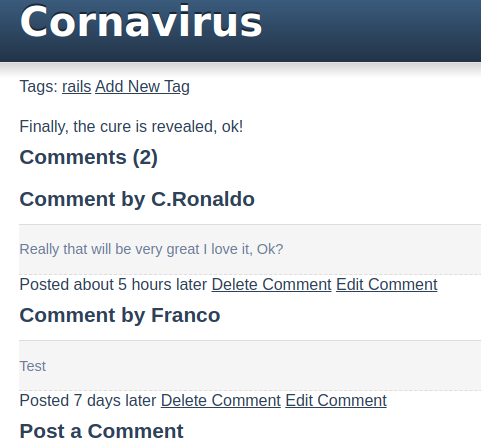

# Ruby on Rails - Blogger

> This is a blog, build with on Rails.

This project was developed with [The Odin Project](https://www.theodinproject.com/courses/ruby-on-rails/lessons/ruby-on-rails-ruby-on-rails.)

## Built With

- Ruby
- Ruby on Rails
- Heroku

## Live Demo

[Blogger App](https://murmuring-blogger.herokuapp.com)

## Getting Started

Clone or copy this repo, follow this guide [Git Tutorial](https://git-scm.com/book/en/v2/Git-Basics-Getting-a-Git-Repository). 

## Authors

👤 **FrancoRosa**

- Github: [@FrancoRosa](https://github.com/FrancoRosa)
- Linkedin: [Franco Rosa](https://www.linkedin.com/in/franco-rosa-79972119b)

👤 **Zakariae El Mejdki**

- Github: [@elmejdki](https://github.com/elmejdki)
- Twitter: [@zakariaeelmejdki](https://twitter.com/0ca7848f87ab470)
- Linkedin: [zakariae el mejdki](https://www.linkedin.com/in/zakariae-el-mejdki-644898139/)

## 🤝 Contributing

Contributions, issues and feature requests are welcome!

Feel free to check the [issues page](issues/).

## Show your support

Give a ⭐️ if you like this project!

## Acknowledgments

- [The Odin Project](https://www.theodinproject.com)
- [Microverse](https://www.microverse.org)

## 📝 License

This project is [MIT](lic.url) licensed.